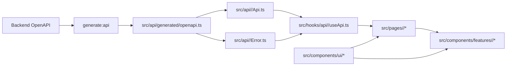

# Frontend Engineering Guide

This guide exists because the project is optimized for agentic coding patterns, and both agents and humans are expected to follow the same conventions to maintain highly consistent, high-quality outcomes.

## 0) Scope and Priority

- Scope: everything under this repository.
- Read order before frontend work:

1. Root `AGENTS.md`
2. This document (`FRONTEND.md`)
3. Test guide (`TEST.md`) when adding/changing tests

- Priority on conflicts:

1. Root `AGENTS.md`
2. This document
3. Local file comments and existing code style

## 0.1) Frontend Project Structure

```text

  src/
    api/          # generated + domain API/error
    hooks/        # api hooks + app hooks
      connectivity/ # desktop server readiness/reconnect lifecycle
      realtime/   # stream subscription lifecycle hooks (non-API)
        core/     # shared stream lifecycle/reconnect hooks
        <domain>/ # domain-specific stream handlers (apiKey, ...)
    pages/        # page-group based (login/settings/main)
    components/
      ui/         # reusable UI components (category folders)
      features/   # domain-specific components
      layout/     # app shell/navigation
    styles/
    utils/
  scripts/
  public/
  src-tauri/    # optional Tauri desktop shell; browser frontend remains supported
```

## 0.2) Frontend Flow and Coupling



## 0.3) Frontend Runtime Loops

Use these loops as the default check when adding or changing frontend behavior. A loop can be marked not applicable, but the reason should be clear before committing.

### 0.3.1) API State Loop

User-driven API behavior should follow this path:

1. Page owns domain hook invocation and user action handling.
2. Domain hook calls the domain API wrapper.
3. Domain API wrapper uses generated OpenAPI types and domain error mapping.
4. Hook normalizes loading, success, and error state for the page.
5. Page passes state and actions into feature components through props.
6. UI refreshes from hook state instead of duplicating API state inside feature components.

Pages and feature components should not import `src/api/*` directly or bypass domain hooks.

### 0.3.2) Realtime Refresh Loop

When backend domain events should update visible UI state, use the realtime refresh loop:

1. Domain realtime hook subscribes through the shared realtime core.
2. Domain event parser validates and dispatches known event types.
3. Affected API state is refetched, invalidated, or updated in one domain-owned place.
4. Pages and feature components rerender from the refreshed hook state.

Keep reconnect/backoff behavior in `src/hooks/realtime/core/*`; keep domain event handling in `src/hooks/realtime/<domain>/*`.

### 0.3.3) Desktop Connectivity Recovery Loop

Packaged desktop behavior should follow this recovery loop:

1. Connectivity hook checks `/health/ready` and tracks desktop server readiness.
2. API and realtime work pause while readiness is unavailable.
3. Manual retry and backoff recovery keep disconnected UI stable.
4. After recovery, stale API/realtime state is refreshed before normal interaction resumes.

Browser runtime must not start desktop readiness polling, and desktop outages must not clear local user/session state.

### 0.3.4) UI Composition Loop

Visual and interaction changes should follow this loop before adding new markup, components, or CSS:

1. Check `src/components/ui/*`, `src/components/layout/*`, and existing feature components for a reusable control or pattern.
2. If the UI is reusable, implement or extend a shared component first and export it from `src/components/ui/index.ts` when applicable.
3. Use shared styles from `src/styles/app.css`; add a reusable class there when a style is likely to repeat.
4. Keep feature/page components focused on composition, state wiring, and domain-specific labels.
5. Verify compact controls have stable dimensions, text fits inside buttons, and internal text/icon spacing is consistent.
6. For collection controls such as pagination, use the shared button/control style, stable item sizing, disabled/current states, and no layout shift when labels or page numbers change.
7. Check the result at mobile and desktop widths before committing when the change affects layout or text fit.

Avoid one-off button spacing, inline pagination styles, page-local control CSS, or duplicated component variants unless the local exception is documented.

## 1) Formatting and Linting

- Prettier is the formatting source of truth for frontend code.
- Required before commit (run in this repository):

1. `npm run format`
2. `npm run format:check`

- Keep formatting and import organization aligned with the frontend VS Code settings file if present.

## 2) TypeScript Rules (Strict)

- TypeScript is mandatory for all frontend code.
- `tsconfig.json` strict mode must remain enabled.
- Avoid `any` unless there is no safe alternative.
- Prefer precise domain types imported from generated OpenAPI schemas.
- Public utilities, hooks, and API wrappers should always declare explicit input/output types.

## 2.1) Type Declaration Convention

- Naming/approach used in this project:

1. Strict TypeScript
2. Explicit typing
3. Contract-first typing (generated OpenAPI types first)

- Declaration rules:

1. Prefer `type` aliases by default.
2. Use `interface` only when extension/implementation semantics are clearly required.
3. Props types must use `XxxProps` naming.
4. API-related local types must use clear suffixes such as `Request`, `Response`, `ErrorDetail`.
5. Keep domain-local types near the domain module; avoid broad global type dumping.
6. Do not introduce `any` without a concrete reason and fallback plan.

## 3) API Contract Rule (`generate:api`, Required)

- The pinned `contracts/openapi.json` is the source for generated API types; backend providers must satisfy this contract.
- Generation sources:

1. Versioned baseline: `contracts/openapi.json` — run `make api-generate`
2. To adopt a contract, update the local snapshot and `contracts/source.json` in a B4React PR; no running server is required.
3. SSE and readiness use generated types too; behavioral contracts are recorded in `contracts/README.md`

- Required generated file:

1. `src/api/generated/openapi.ts`

- Rules:

1. Use generated types from `src/api/generated/openapi.ts` in API/hook/page layers.
2. Do not maintain duplicate handwritten contract types for OpenAPI-backed endpoints.
3. If backend API schema changes, update the pinned local baseline and run `make api-generate` before API call site edits.
4. `npm run build` is server-independent by default (no OpenAPI fetch during build).
5. Use `npm run build:sync` for local contract regeneration + build.
6. Use `npm run build:strict` (or `npm run generate:api`) when strict OpenAPI refresh from the pinned contract is required.

## 4) Domain API/Error/Hook Rule (1:1:1, Required)

- Domain modules must be co-located under `src/api/<domain>/`.
- Each domain must include:

1. `<domain>Api.ts`
2. `<domain>Error.ts`
3. `src/hooks/api/<domain>/use<Domain>Api.ts`

- Examples:

1. Auth router domain -> `src/api/auth/authApi.ts` + `src/api/auth/authError.ts` + `src/hooks/api/auth/useAuthApi.ts`
2. API key router domain -> `src/api/apiKey/apiKeyApi.ts` + `src/api/apiKey/apiKeyError.ts` + `src/hooks/api/apiKey/useApiKeyApi.ts`
3. Events router domain -> `src/api/events/eventsApi.ts` + `src/api/events/eventsError.ts` + `src/hooks/api/events/useEventsApi.ts`

- When adopting a new contract domain, add the same domain 1:1:1 set in the B4React change and coordinate the provider update.
- Do not place domain error parsing/mapping in `src/utils`; keep it inside each domain API folder.
- API interface chain is mandatory:

1. `generated_api_schema`
2. `api/<domain>`
3. `hooks/api/<domain>`
4. actual usage (`pages/components`)

- Realtime stream note:

1. If backend auth for stream requires bearer token, do not use native `EventSource` for authenticated streams.
2. Use `fetch` streaming in domain API layer so `Authorization` header can be sent.
3. Reconnect/backoff policy should be implemented in `src/hooks/realtime/core/*`.
4. Domain event parsing/dispatch logic should be implemented in `src/hooks/realtime/<domain>/*`.

- Desktop connectivity note:

1. Packaged Tauri runtime readiness is checked through `/health/ready`; `navigator.onLine` is only a hint.
2. Desktop reconnect/backoff ownership stays in `src/hooks/connectivity/*`.
3. Browser runtime must not start desktop readiness polling.
4. Realtime subscriptions must pause while desktop readiness is unavailable and resume after recovery.
5. Missing `/config` data must fail closed; only an explicit `login_enabled=false` response may unlock login-disabled routes.
6. Desktop outage status belongs in the sidebar footer beside the profile control or standalone/public-navbar actions, not in a page-wide overlay.
7. Public navbars must use symmetric outer columns and reserve compact status width so status label changes never shift the centered title.
8. Manual retry UI must avoid flashing transient loading states; keep the disconnected label stable and only show heavier loading affordances after a short delay.
9. Profile-menu sign-out must be disabled while packaged desktop connectivity is not `online`; do not clear the local user or route to `/login` during a server outage.

- `pages/components` must not import from `src/api/*` directly; they must consume domain hooks only.
- API hooks must be placed under `src/hooks/api/<domain>/*`.
- Non-API hooks (state/session/theme/feature/auth-context) must stay outside `src/hooks/api/*`.
- Page and hook responsibility rule:

1. Domain hook invocation is owned by page layer.
2. Pages must be organized by concrete page groups (for example `pages/login`, `pages/settings`, `pages/main`).
3. Domain feature components should receive state/actions via props and should not call domain API hooks directly.
4. Components may use non-domain hooks (for example UI state/theme/i18n) when needed.

## 5) Error Code Handling Rule

- Error handling must be based on backend-defined error codes and generated schema types.
- Maintain exhaustive code-to-message mapping with `Record<ErrorCode, ...>` style patterns.
- When new backend error codes appear, frontend mapping must fail fast at compile time until explicitly handled.
- Normalize unknown/non-schema errors to a safe fallback message path, while preserving known code branches.

## 6) Component and Style Rule (Showcase-First)

- Reuse shared UI components first, then feature-level components, then page composition.
- Component directory responsibilities:

1. `src/components/ui/*`: low-level reusable primitives
2. `src/components/layout/*`: app shell/navigation/layout-level components
3. `src/components/features/<domain>/*`: domain-specific feature components

- Required component priority:

1. `src/components/ui/*`
2. `src/components/layout/*` when composition reuse is needed
3. `src/components/features/<domain>/*` for domain-bound compositions
4. `src/pages/*` (composition-focused, minimal raw markup)

- Before creating a new component:

1. Check whether an equivalent component already exists in shared UI.
2. Check whether it belongs to `ui` (reusable) or `features/<domain>` (domain-specific).
3. Create it as a component unit, not inline page markup.
4. If a new reusable UI component is added, register a usage example in `src/pages/main/ShowCasePage.tsx`.

- UI folder rule:

1. Place UI components under category folders by component nature (`buttons`, `cards`, `dropdowns`, `lists`, `inputs`, `switches`, `toggles`, etc.).
2. Keep `src/components/ui/index.ts` as the export entry and update it whenever UI files are added/moved.

- Style rules:

1. All frontend CSS must be managed in `src/styles/app.css`.
2. Do not add separate page/component CSS files unless a documented exception is approved.
3. Avoid one-off style duplication when a reusable class or component style can be extracted.
4. Scrollbars must follow the global rules in `src/styles/app.css` so every scrollable container keeps a consistent style.

## 6.1) Collection Navigation and Overflow Rule

- Use industry-standard collection patterns instead of unbounded card rendering:

1. Card collections that can exceed 6 items must use pagination by default.
2. Use `client-side pagination` only when the current API already returns the complete bounded collection; use `server-side pagination` or `cursor pagination` when the collection can grow without a predictable upper bound.
3. Pagination controls must render as a numbered pager with a pagination window: boundary pages, nearby sibling pages, and ellipsis truncation, for example `1 2 3 4 5 ... 12` or `1 ... 4 5 6 ... 12`.
4. Pagination controls must expose accessible labels, `aria-current="page"` for the active page, and previous/next icon buttons.
5. Paginated card lists must preserve layout stability across pages by reserving the same page-size slots on short final pages, so the content area's height and width do not shrink when fewer items remain.
6. Long card lists must be wrapped in an overflow-contained `scroll container` with explicit `max-height` or layout constraints, so content does not push navigation, headers, or neighboring panels off-screen.
7. Avoid nested page-level scrolling. Prefer one bounded content scroll region inside the affected panel and keep global scrollbars following `src/styles/app.css`.

## 7) Build and Runtime Notes

- Install dependencies:

1. `npm ci` (or `npm install` when lockfile update is intended)

- Local dev:

1. `npm run dev`
2. `npm run tauri:dev` for the optional desktop shell (requires Rust)

- Production build:

1. `npm run build`
2. `npm run build:sync` (local contract regeneration)
3. `npm run build:strict` (uses the pinned contract)
4. `npm run build:desktop` builds shared assets into `dist/`, like the web build

- The build pipeline only writes `dist/`. Consuming backend repositories own copying or packaging these artifacts.

## 8) Internationalization Rule (Required)

- All user-facing text must be managed through i18n keys.
- Do not hard-code display strings in pages/components/modals/buttons/messages.
- Add or update locale entries first (for example `src/locales/en.json`), then reference keys in UI.
- Exception: non-user-facing internal identifiers (for example API field names, enum values, route paths) can remain as literals.

## 9) Completion Checklist

1. TypeScript strict mode preserved and no unnecessary `any`
2. API types regenerated when backend contract changed
3. New backend domains include frontend domain pair (`<domain>Api.ts` + `<domain>Error.ts`)
4. Error code maps are exhaustive for added backend codes
5. Shared components reused before page-level raw markup
6. All user-visible text is i18n-key based
7. Prettier format and check completed (`npm run format`, `npm run format:check`)
8. Frontend automated tests completed (`npm run test`)
9. Type checking completed (`npx tsc --noEmit` or `npm run build`, where build includes `tsc`)

## Automated Layer Boundaries

`make architecture-check` uses the installed TypeScript compiler and tsconfig module
resolution. It runs in `make check`, standalone frontend CI, and the parent repository's
required Frontend checks job through `make frontend-architecture-check`.

- Pages and components cannot import runtime values from src/api.
- Components (including features/layout/ui) cannot import runtime domain hooks from
  src/hooks/api; pages own their invocation and pass state/actions through props.
- Explicit import type, inline type imports and type-only exports remain allowed.
- Named re-exports/barrel aliases are resolved to their original declarations;
  namespace/star/dynamic module imports are also inspected.
- DOM fetch/XMLHttpRequest references and axios/openapi-fetch runtime imports are
  rejected in pages/components. Local callbacks named fetch are not DOM globals.
- Computed runtime import paths and runtime import-equals are rejected in UI code.

The checker inspects static dependencies; it does not prove loading/error-state
ownership or detect arbitrary helper wrappers, reflection or every HTTP library.
Keep such architectural decisions in the worklog and review. The UI composition harness below separately checks showcase coverage. No new runtime/tool dependencies.

## API Key State Reconciliation

SettingsPage invokes useApiKeys for list/loading/errors/mutations. The existing
useApiKeyApi is a transport facade consumed by the state hook. Pages retain modal,
input, clipboard and one-time secret state; feature components receive props.
HTTP and SSE records share an ID-based upsert, preserving server list ordering.
Every connection (including reconnect) and developer-tab activation refetches the
list. Desktop offline pauses new work; recovery refetches. Events and mutation
completion also reconcile against the server. Sequence/revision guards reject stale
list responses; account change/unmount invalidates old async results.
Background reloads preserve visible items. Concurrent duplicate mutations of each
operation kind are guarded; status toggles are serialized and controls disabled
while a toggle is in flight. Switching settings tabs does not discard a pending
create response/one-time secret. Account change clears secret/modal state.
Redis pub/sub has no replay and is best-effort: these refetches recover missed
changes on reconnect/activation, but do not provide continuous or durable delivery.

## Component Geometry and Tooltip Placement

Shared geometry lives in `src/styles/app.css`: use the 4/8/12/16/20/24/32px spacing
scale (`--space-*`), 8px control, 12px card, and 16px panel radii. Standard controls
are 36px high (44px for coarse pointers); compact pagination and dialog actions retain their explicit sizes.
Use 8px label/control and icon/text spacing, 16–24px card padding, and readable
1.25–1.5 line heights. These are project conventions inspired by the
[Atlassian spacing foundation](https://atlassian.design/foundations/spacing), not a
universal compliance standard. Preserve the existing palette and brand.

AppLayout replaces the app navbar with a persistent sidebar: 48px collapsed /
224px default expanded (resizable from 200–360px), with 32px icon controls and 32px navigation rows. Coarse pointers use a 60px rail and 44px
controls. The collapsed brand opens the sidebar and swaps to an expand icon on
hover/keyboard focus; the expanded header shows only left-aligned B4A text (no
brand icon), aligns it with menu icons using 12px horizontal padding without a
hover fill, and puts the close button at the right edge.
Width/content inset transitions take 180ms and respect reduced motion. Both states
use the same background token. Labels and the profile name appear when expanded.
Mobile expansion overlays content with a dismissible backdrop. Profile and connectivity live in the footer. Public navigation remains symmetric; native app
windows retain a dedicated drag/window-control strip.

Menu rows share one 8px icon/text gap, fill their container, and grow for wrapped
labels. Profile popovers open beside the rail or above the expanded footer.

Tooltips measure their actual rendered child control, render in a body portal,
and flip/clamp within the viewport with an 8px gap and edge inset. Position updates
on nested scroll, window resize, and trigger/content resize; completely clipped
anchors hide their tooltip. Computed tooltip top/left coordinates and the persisted sidebar width CSS variable
are dynamic inline-style exceptions; appearance stays in app.css. Supply one control that
forwards `aria-describedby`; hover and focus open it, click/Escape dismiss it.
Tooltips use 12px text, 16px line height, 4px/8px padding, and a 6px radius.
Light mode uses a black tooltip with white text; dark mode uses a white tooltip
with black text, including system appearance. `make test-ui` verifies anchor
placement, inverse theme colors, scrolling, edge collision, and mobile overflow.

Tooltip visibility distinguishes keyboard-visible focus from pointer-acquired DOM
focus. A click may leave a control focused, but subsequent pointer leave must close
its hover tooltip. Only keyboard focus retains a tooltip when the pointer leaves;
window blur dismisses it. Preserve click/Escape dismissal during icon replacement.

Pointer movement outside the trigger also dismisses hover-only tooltips when navigation or reload interrupts the usual leave event.

Settings opens from the footer profile popup. Expanded popovers match the sidebar
inner width and follow resizing; collapsed popovers clamp to the viewport. The
popup groups avatar/name/email, settings, and logout when available, with breathing
room around the logout divider. Hover uses a 12% foreground mix without borders.
Legacy ThemeToggleButton remains showcase-only; actual auth, navbar,
profile, and titlebar surfaces use no old theme toggle.

## Settings workspace and shared resizing

Settings uses the same AppSidebar instance, B4A header, collapse button, animation,
footer and colors as the app. Back to app is the first item below the header,
followed by existing General, Appearance, Profile and Developers sections. A
validated section query parameter drives both the sidebar selection and page.
No separate settings navigation is rendered. Profile uses a compact photo row and
grouped identity fields. Settings and showcase use ThemePreviewSelector for
system/light/dark previews, pressed state and existing local-storage persistence.

The expanded sidebar starts at 224px, resizes between 200–360px via pointer capture,
and persists its width locally. The separator supports arrow keys, Home/End and
double-click reset. During dragging width transitions are disabled. Mobile width
is clamped to leave backdrop space; coarse pointers retain 44px controls.
Cards/sidebar use 0.5px low-contrast dividers. Menu/dropdown/profile hover changes
background only; keyboard focus and selected-theme outlines remain visible.

API-key management uses a semantic table with aligned identity, status, request
count/last use, expiry and actions. Creation/reveal/delete reuse compact Modal.
The table owns overflow and keeps six-row pagination slots. Only key prefixes
appear in the table; the one-time secret remains in its existing reveal flow.
Desktop controls are 36px with 13px button/menu text, 14px body text at weight 400,
500-weight controls and 600-weight headings. Coarse pointers retain 44px targets.

## Keyboard shortcuts and dropdown alignment

KeyboardShortcut is the shared, showcased shortcut hint. A `mod` key renders as
Command on macOS and Control on Windows/Linux using the detected user agent.
APP_SHORTCUTS supplies both hints/ARIA and app-shell matching: Mod+B toggles the
sidebar; Mod+, opens settings. Ignore editable targets, modal dialogs, composition,
repeat, AltGraph and already handled events. The hook cleans up its listener.
DropdownMenu matches its trigger width and opens 4px below it; long labels wrap.

Dropdown triggers and items use 32px minimum heights, 13px regular text and 8px
horizontal padding; coarse pointers retain 44px targets.

## Guest showcase and authentication dialogs

The root route opens the public showcase; `/welcome` retains the landing page.
The shared app shell remains visible for guests. Its profile menu offers existing
settings and a login call-to-action, with no billing/help or unsupported providers.
`/login` and `/signup` overlay the showcase with the shared Modal and page-owned
auth hooks. Login presents configured Google/GitHub providers and an email-first
step, then existing password/session/error/recovery behavior. Disabled providers
stay hidden. General/Appearance settings are public; Profile/Developers require an account. Unavailable config
still fails closed. Logout returns to the public showcase.
Auth dialogs opt into Escape dismissal, focus containment and restoration. Modal
backdrops use a single transparent 6px blur without a dark color overlay, preserving
underlying light/dark palette. Shared PanelCard supports a title owned by its dialog.

The profile footer trigger reserves 5px inner padding in the collapsed 40px control,
and 7px/10px padding in the expanded 44px row. Touch minimums remain 44px.

All account creation, password recovery/reset, sent-confirmation and email
verification pages compose AuthPageFrame. It owns shared dialog chrome while pages
keep dynamic titles, route state and domain hooks. Button exposes pill and
pill-secondary appearances; the auth pages, OAuth buttons and showcase use these
same variants. Showcase includes enabled/loading/disabled variants and an interactive
auth-frame preview. Status cards use a compact icon/message layout (alert for errors
and warnings, status for information); validation criteria use neutral pending marks
and accessible met/pending labels. Anonymous auth-enabled profile triggers use the
localized login/signup entry label.

## Recent accounts and switching

Remember accounts is opt-in and reuses the existing remember-email preference.
Successful email login or authenticated OAuth return stores at most five identities
for 90 days per browser/origin: email, name, provider, last-use time and optional
profile image. Large uploaded images become 64px thumbnails; unsafe/oversized image
references are discarded. Profile load/update refreshes saved metadata, while a
removed record is never recreated by that refresh. Passwords/tokens are excluded.
Malformed storage is ignored; storage failures never prevent authentication.

RecentAccountList is shared with the showcase and sits immediately before the
remember-account checkbox. Individual/all deletion and cross-tab refresh are
supported. Profile identity opens current/recent accounts and Add account. A
`switch=1` auth route allows a signed-in user to authenticate another identity;
closing it preserves the current session. Email choices prefill the password step.
OAuth choices use enabled provider endpoints and clear the old access-token cache
before navigation; the return restores the server cookie session and records only
a valid, opted-in provider intent. Provider account selection stays provider-owned.
This is history, not a multi-session credential store; switching requires authentication.

Account switching renders in a separate body portal beside the profile popup,
flipping left when needed and clamping to the viewport. Dynamic top/left coordinates
are an inline-style exception; scroll/resize/content changes update placement.
Shared UserAvatar crops photos into circles and falls back to initials on load errors.

Guest settings expose only General and Appearance. Shared section resolution normalizes account-only guest URLs to General; no account API work starts.

BrandMark uses robot SVG assets with adaptive light/dark tones and plain/tile variants. BrandBanner composes the mark and localized B4A wordmark; both palettes are showcased. Expanded sidebar retains its text-only header. The favicon uses the same silhouette with system color-scheme adaptation.

Transparent plain marks are the default, including banners and favicon. Rounded tiles remain optional. Matching PNGs (512px mark/tile; 1024×320 banner) and SVGs live under public/icons/b4a-\*.

## Component catalog and shared-style harness

The catalog has localized category/search controls and isolated interactive fixtures.
Use actual shared UI/feature components; previews must not call account APIs or start OAuth.
New public UI exports need rendered JSX examples in ShowCasePage or features/showcase.
`make ui-composition-check` resolves TypeScript symbols, including import aliases, to
check that coverage; it rejects extra source CSS/SCSS/Sass/Less files, inline JSX
appearance/style elements and raw buttons copying ui-button classes. It runs through
architecture-check in child and parent CI. Fixture tests check both acceptance and rejection.
Dynamic sidebar width and profile account popup coordinates are narrowly allowed
expressions; tooltip positioning remains DOM geometry managed by the shared overlay.
This is a static guard, not proof of visual quality or detection of all possible
duplicated designs; browser layout checks and visual review remain required.
See [component audit](notes/component-audit.md) for retained and removed components.

Actual LoadingPage and ShowCaseNotFoundPage now share PageStateFrame, compact PanelCard chrome, localized copy and shared actions. Startup loading uses the same composition; only the catalog loading preview exposes a return button. The UI harness also requires runtime exports in ui files to be exposed through the public barrel.

Profile account switching requires an authenticated identity and explicitly enabled login. Disabled or unavailable login configuration renders a static identity with settings, without switch/add-account controls.

Recent history identifies accounts by normalized email across email/Google/GitHub login. Keep only the most recent successful method per identity. Reading existing storage collapses legacy provider-specific duplicates; deletion removes that identity regardless of method. This only changes local history, not server OAuth linking.

## Administrator workspace

AdminPage at `/admin` reuses AppLayout, the resizable sidebar, settings content frame
and shared input, dropdown, badge, button and pagination controls. Only users with
role admin see its profile entry or mount its data hook, including bootstrap admins.
The auth API provides a paginated read-only directory with name/email search, role
and account-enabled filters, global counts and last successful login times.
Roles remain server-command managed. Active is not online presence; times use the
browser locale/time zone. Never display credential/IP/provider identifiers.
The typed auth hook clears stale data on owner/query changes or request failure,
ignores aborted results, pauses desktop requests offline and refetches on recovery,
focus/visibility and manual refresh. No realtime user events or background polling
are introduced. No new shared UI exports are needed; showcase contracts remain intact.

## Shared application configuration

AppConfigProvider owns one in-memory snapshot and in-flight /config request per app instance. useAppConfig consumers and auth ensureConfig share it, including StrictMode startup. Explicit reload coalesces concurrent callers. Failed startup stays unavailable, never login-disabled. No snapshot/token is persisted. ConnectivityRecovery reloads config before revalidating auth; failed recovery preserves the session. App retry also restores auth from the shared snapshot. Page navigation does not refetch config.

## Route loading

Secondary settings/admin/auth/welcome screens use module-level React.lazy. Showcase and shared chrome remain eager. RouteBoundary keeps the shell mounted during Suspense and shows localized explicit reload/home actions after chunk or render failure. Auth overlays have a nested boundary to retain their showcase backdrop. Reload is deliberate because rejected lazy imports remain cached; never auto-reload on errors. Keep older hashed assets available during deployment transitions. `make test-routes` builds and exercises actual production chunks, including delayed and failed downloads. See [React lazy](https://react.dev/reference/react/lazy).

## State ownership and memoization loop (de facto)

For every runtime change: identify state owner/consumers/frequency → isolate local state → apply React.memo at costly children with unchanged props (or record why not) → stabilize relevant props/derivations → verify skipped work and necessary updates → record evidence. Current library decision: keep scoped providers and hooks; prefer evaluating Zustand for future frequent cross-screen client state, Redux Toolkit for complex event-driven domain state. See [state inventory, adoption criteria and harness](notes/react-performance.md). `make check` enforces protected boundaries, and Git governance requires State Ownership/Memoization/Performance Evidence in runtime worklogs. AdminUserTable is memoized with the original items reference and one date formatter per language; the page still owns its API hook.

AvatarUploadField uses the shared control-height token for both its file-selection label and removal Button; settings overrides must not give them different heights. Coarse-pointer profile actions retain their 44px minimum target.

## Project-local branding

Copy `project.example.json` to ignored `project.local.json` to configure public name,
short wordmark and native reverse-DNS application identifier. Optional logo_url and
logo_dark_url reference local public image paths. Vite validates the file and embeds
immutable identity, escapes the HTML title and replaces the favicon when a logo is
provided. Both locale resources use that identity; BrandMark reuses its existing
light/dark image composition. No config API schema or runtime store is added.

The Tauri launcher merges productName, identifier and window titles for dev/build/
bundle (including mobile dev/build), preserving base window geometry. Explicit CLI
config arguments take precedence. Use npm/Make launchers to apply identity; directly
invoking a raw tauri binary bypasses this wrapper. Package/crate/source-module names
and native installer icons stay unchanged. Restart Vite and rebuild after changes.

A consuming repository may generate project.local.json and public/project-brand/
as build inputs; B4React never reads parent files. Keep public identity source in
that repository and reproduce these ignored outputs before CI/deployment builds.
`make project-config-check` tests validation, HTML and launcher overrides;
`make test-routes` verifies default or custom identity in English/Korean production.

## Local showcase style studio

`make style-studio` explicitly starts Vite on loopback with `B4F_STYLE_STUDIO=1`.
A compact fixed right panel edits the existing showcase components. Color, shape, typography and spacing groups collapse independently; apply/reset stay visible. On narrow screens open it with the Styles button. The header reload button discards the draft and rereads the fixed `src/styles/app.css` target; local paths are not displayed. The root is Vite's own resolved project directory;
it never reads a consuming repository. Normal dev, production and Tauri builds
exclude the editor and filesystem protocol. Keep the server local; do not proxy
or expose this developer tool to other users.

Light/dark background, panel, input, text, button and hover colors plus shared
radius, spacing/padding and base typography are defined by `src/dev/styleTokens.json`.
The font-family token replaces the repeated Inter family in shared styles; base
font size/weight/line height apply to inherited text, preserving component-specific
sizes/weights. The primary button-hover token has distinct light/dark defaults. Neutral and danger controls own compatible hover fills instead of inheriting the primary inverse fill.
Lengths use bounded rem values. Colors accept six-digit hex or numeric rgba;
font choices are allowlisted. The custom ColorPicker uses a saturation/value plane, rainbow hue strip and thin opacity strip. The plane supports arrow keys and pointer/touch; the two sliders have accessible names. HEX/RGBA entry stays in the field. Explicit dark and system-dark declarations update
together. This is a supported-token editor, not an arbitrary CSS/code editor.

The page owns the development API hook and draft; React state stays inside the
lazy editor so typing does not rerender the catalogue. The editor is a body portal outside the preview boundary, so draft values do not restyle the controls. There are no synthetic preview cards. The preview effect is an
explicit exception to static appearance ownership: it temporarily overrides only
the allowlisted CSS custom properties on the component catalogue container and cleans them up on
unmount. Actual styling and persisted token definitions remain in app.css. Body
portals and hardcoded/component-specific appearance outside those tokens are not
part of this scoped preview. No store or new provider is needed.

The local Vite protocol lives under `/__b4f/style-studio/`, independently of the
FastAPI OpenAPI contract. It uses the API/error/hook ownership pattern with local
protocol types, not generated FastAPI types. Reads and writes require loopback,
same-origin POST and a per-process capability. Apply validates the token schema,
rejects a changed whole-file hash, saves the previous CSS under ignored
`.style-studio-backups/`, and atomically replaces app.css. Preview/discard never
write files; reload explicitly discards the draft. Applied edits are ordinary Git
working-tree changes and HMR updates. Backups may be restored manually after
reviewing intervening edits; reset only discards the unsaved preview.

ColorPicker is shared and registered in the catalogue. Its scoped --picker-\* variables carry validated color and pointer geometry; this is an explicit dynamic-style exception. All appearance stays in app.css. The plane supports pointer/touch and arrow keys; named range controls provide keyboard hue and opacity. Escape closes the palette before the editor.

The editor uses the catalogue-owned useTheme and ThemePreviewSelector (system/light/dark). Mode changes update and persist the global app theme, including sidebar/editor and catalogue selectors; system follows OS changes. Token drafts remain scoped to the catalogue. Its icon-only collapse control has a Tooltip; opening/closing and catalogue padding animate together for 180ms, with reduced-motion support. ColorPicker opens an anchored non-modal dropdown below the field, flips when space is insufficient, and closes on outside pointer/Escape. The small square swatch is flush inside the code field.

The preview includes catalogue navigation and the surrounding main background; global mode selection updates the sidebar and editor too. Automatic brand assets follow the preview theme. NumberField provides bounded increment/decrement buttons and units, with a rendered catalogue example. Editor font choices reuse DropdownMenu.

ColorPicker uses only the plane and hue/opacity strips, without presets, duplicate code entry or a confirmation button.

## Shared collection state

Use `useCollectionQuery` for draft/applied search and filter/page transitions, `getPagination` for known totals, and `useClientPagination` for complete local collections. Keep domain HTTP hooks and existing shared controls. Follow [rules and examples](notes/collections.md), including unknown-total handling and the existing API-key full-list compatibility exception.

## Theme contrast and selectable cards

Shared buttons must retain a compatible foreground/background pair on hover. Neutral modal/copy controls override their local hover fill; danger actions retain red with white text. Disabled/loading buttons do not acquire hover colors. Spinners follow currentColor. Keep explicit and system dark tokens synchronized. Sidebar expanded/collapsed states share `--sidebar-bg`, subtly separated from the main `--bg`; light cards use the common border token and one-pixel catalogue boundaries.

`SelectionCard` is a controlled shared Button wrapper: `selected` drives `aria-pressed`; native `onClick`, `disabled`, focus and keyboard activation are preserved. The caller owns single/multiple selection; do not use it as a link or put nested interactive content inside it. Use `.selection-card-group` for wrapping option groups and provide a group label. Example: `<SelectionCard selected={value === "one"} onClick={() => setValue("one")}>Option one</SelectionCard>`. Category navigation and the searchable Cards → SelectionCard example reuse it; the example includes selectable and disabled options. Selection pairs use button foreground/background, while unselected options use neutral panel/text colors.

`make test-ui` checks enabled text contrast (at least 4.5:1) before/after hover for primary, neutral, danger, copy and selected/unselected controls in system/explicit light/dark themes. It also verifies disabled hover stability, sidebar separation, mobile/desktop layout and keyboard selection. Custom studio color choices remain user-controlled and are not automatically contrast-corrected.
