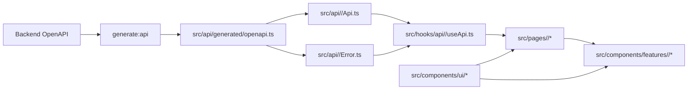

# 프론트엔드 엔지니어링 가이드

이 프로젝트는 에이전트 중심 코딩 패턴에 맞춰 최적화되어 있으며, 사람과 에이전트 모두 일관되고 높은 품질의 결과를 유지하기 위해 동일한 규칙을 따라야 합니다.

## 0) 범위와 우선순위

- 범위: B4React 저장소 하위 전체
- 프론트엔드 작업 전 읽기 순서:

1. 루트 `AGENTS.md`
2. 이 문서 (`FRONTEND.md`)
3. 테스트 추가/변경 시 테스트 가이드 (`TEST.md`)

- 충돌 시 우선순위:

1. 루트 `AGENTS.md`
2. 이 문서
3. 로컬 파일 주석 및 기존 코드 스타일

## 0.1) 프론트엔드 프로젝트 구조

```text

  src/
    api/          # generated + domain API/error
    hooks/        # api hooks + app hooks
      connectivity/ # 데스크톱 서버 readiness/재연결 라이프사이클
      realtime/   # 스트림 구독 라이프사이클 훅 (비 API)
        core/     # 공통 스트림 라이프사이클/재연결 훅
        <domain>/ # 도메인별 스트림 핸들러 (apiKey, ...)
    pages/        # page-group based (login/settings/main)
    components/
      ui/         # reusable UI components (category folders)
      features/   # domain-specific components
      layout/     # app shell/navigation
    styles/
    utils/
  scripts/
  public/
  src-tauri/    # 선택형 Tauri 데스크톱 셸; 브라우저 프론트엔드도 계속 지원
```

## 0.2) 프론트엔드 흐름과 결합 구조



## 0.3) 프론트엔드 런타임 루프

프론트엔드 동작을 추가하거나 변경할 때 다음 루프를 기본 확인 항목으로 사용합니다. 해당하지 않는 루프는 “해당 없음”으로 볼 수 있지만, 커밋 전에 이유가 명확해야 합니다.

### 0.3.1) API State 루프

사용자 주도 API 동작은 다음 경로를 따라야 합니다.

1. 페이지가 도메인 hook 호출과 사용자 action 처리를 소유
2. 도메인 hook이 도메인 API wrapper 호출
3. 도메인 API wrapper가 생성된 OpenAPI 타입과 도메인 에러 매핑 사용
4. hook이 loading, success, error 상태를 page용으로 정규화
5. page가 state와 action을 feature component에 props로 전달
6. UI는 feature component 내부에 API state를 중복하지 않고 hook state에서 갱신

페이지와 feature component는 `src/api/*`를 직접 import하거나 도메인 hook을 우회하면 안 됩니다.

### 0.3.2) Realtime Refresh 루프

백엔드 도메인 이벤트가 화면 상태를 갱신해야 한다면 realtime refresh 루프를 사용합니다.

1. 도메인 realtime hook이 shared realtime core를 통해 구독
2. 도메인 이벤트 parser가 알려진 event type을 검증하고 dispatch
3. 영향받은 API state는 도메인 소유 위치 한 곳에서 refetch, invalidate, update
4. page와 feature component는 갱신된 hook state에서 rerender

재연결/backoff 동작은 `src/hooks/realtime/core/*`에 두고, 도메인 이벤트 처리는 `src/hooks/realtime/<domain>/*`에 둡니다.

### 0.3.3) Desktop Connectivity Recovery 루프

패키징된 데스크톱 동작은 다음 복구 루프를 따라야 합니다.

1. connectivity hook이 `/health/ready`를 확인하고 desktop server readiness 추적
2. readiness가 유효하지 않은 동안 API와 realtime 작업 중단
3. 수동 재시도와 backoff 복구는 disconnected UI를 안정적으로 유지
4. 복구 후 stale API/realtime state를 갱신한 뒤 정상 상호작용 재개

브라우저 런타임에서는 desktop readiness polling을 시작하면 안 되며, desktop outage가 local user/session state를 지우면 안 됩니다.

### 0.3.4) UI Composition 루프

시각/상호작용 변경은 새 markup, component, CSS를 추가하기 전에 다음 루프를 따라야 합니다.

1. `src/components/ui/*`, `src/components/layout/*`, 기존 feature component에서 재사용 가능한 control 또는 pattern 확인
2. 재사용 가능한 UI라면 shared component를 먼저 구현/확장하고, 해당하는 경우 `src/components/ui/index.ts`에서 export
3. `src/styles/app.css`의 shared style을 사용하고, 반복될 가능성이 있는 style은 이 파일에 reusable class로 추가
4. feature/page component는 composition, state wiring, 도메인별 label에 집중
5. compact control은 stable dimension, button 내부 text fit, text/icon 간격 일관성 확인
6. pagination 같은 collection control은 shared button/control style, 안정적인 item size, disabled/current state, label 또는 page number 변화 시 layout shift 방지를 확인
7. layout 또는 text fit에 영향을 주는 변경은 커밋 전 mobile/desktop 폭에서 결과 확인

명시된 예외가 없다면 일회성 button spacing, inline pagination style, page-local control CSS, 중복 component variant를 피합니다.

## 1) 포맷팅과 린팅

- 프론트 코드 포맷의 기준은 Prettier입니다.
- 커밋 전 필수 (B4React 저장소에서 실행):

1. `npm run format`
2. `npm run format:check`

- 프론트 VS Code 설정 파일이 있다면 포맷/임포트 정렬을 일치시켜야 합니다.

## 2) TypeScript 규칙 (Strict)

- 모든 프론트 코드는 TypeScript 필수
- `tsconfig.json`의 strict 모드는 반드시 유지
- 안전한 대안이 없는 경우를 제외하고 `any` 사용 지양
- 생성된 OpenAPI 스키마의 정밀한 도메인 타입 우선 사용
- 공개 유틸, 훅, API 래퍼는 입력/출력 타입을 명시적으로 선언

## 2.1) 타입 선언 컨벤션

- 이 프로젝트의 네이밍/접근 방식:

1. Strict TypeScript
2. 명시적 타이핑
3. 계약 우선 타이핑 (OpenAPI 생성 타입 우선)

- 선언 규칙:

1. 기본적으로 `type` alias 우선
2. 확장/구현 의미가 명확할 때만 `interface` 사용
3. Props 타입은 `XxxProps` 네이밍 사용
4. API 관련 로컬 타입은 `Request`, `Response`, `ErrorDetail` 같은 명확한 suffix 사용
5. 도메인 로컬 타입은 도메인 모듈 근처에 유지하고, 전역 타입 dumping 금지
6. 명확한 사유와 fallback 계획 없이 `any` 도입 금지

## 3) API 계약 규칙 (`generate:api`, 필수)

- 백엔드 OpenAPI는 API 계약의 단일 기준입니다.
- 생성 소스:

1. 버전 관리 기준: `contracts/openapi.json` — `make api-generate`
2. 계약 도입 시 로컬 스냅샷과 `contracts/source.json`을 B4React PR에서 갱신합니다. 실행 중인 서버는 필요하지 않습니다.
3. SSE·readiness도 생성 타입을 사용하며 동작 계약은 `contracts/README.md`, 한국어는 `notes/ko/contracts/README.md` 참고

- 필수 생성 파일:

1. `src/api/generated/openapi.ts`

- 규칙:

1. API/hook/page 레이어에서 `src/api/generated/openapi.ts` 타입을 사용
2. OpenAPI 기반 엔드포인트에 대해 중복된 수기 계약 타입 유지 금지
3. 백엔드 API 스키마가 바뀌면 API 호출부 수정 전에 고정된 로컬 계약을 갱신하고 `make api-generate` 실행
4. `npm run build`는 기본적으로 서버 비의존(OpenAPI fetch 없음)
5. 로컬 계약 갱신 + 빌드는 `npm run build:sync` 사용
6. 로컬 계약 타입 갱신이 필요하면 `npm run build:strict`(또는 `npm run generate:api`) 사용

## 4) 도메인 API/Error/Hook 규칙 (1:1:1, 필수)

- 도메인 모듈은 `src/api/<domain>/` 아래에 공존해야 합니다.
- 각 도메인은 다음을 포함해야 합니다:

1. `<domain>Api.ts`
2. `<domain>Error.ts`
3. `src/hooks/api/<domain>/use<Domain>Api.ts`

- 예시:

1. Auth router 도메인 -> `src/api/auth/authApi.ts` + `src/api/auth/authError.ts` + `src/hooks/api/auth/useAuthApi.ts`
2. API key router 도메인 -> `src/api/apiKey/apiKeyApi.ts` + `src/api/apiKey/apiKeyError.ts` + `src/hooks/api/apiKey/useApiKeyApi.ts`
3. Events router 도메인 -> `src/api/events/eventsApi.ts` + `src/api/events/eventsError.ts` + `src/hooks/api/events/useEventsApi.ts`

- 신규 백엔드 router/domain이 추가되면 같은 작업 사이클에서 프론트에도 1:1:1 세트를 반드시 추가
- 도메인 에러 파싱/매핑을 `src/utils`에 두지 말고 각 도메인 API 폴더 내부에 유지
- API 인터페이스 체인은 필수:

1. `generated_api_schema`
2. `api/<domain>`
3. `hooks/api/<domain>`
4. 실제 사용처 (`pages/components`)

- 실시간 스트림 참고:

1. 스트림 인증이 bearer token 기반이면 native `EventSource`로 인증 헤더를 보낼 수 없습니다.
2. 인증 스트림은 도메인 API 레이어에서 `fetch` 스트리밍 방식으로 구현합니다.
3. 재연결/backoff 정책은 `src/hooks/realtime/core/*`에서 처리합니다.
4. 도메인 이벤트 파싱/디스패치는 `src/hooks/realtime/<domain>/*`에서 처리합니다.

- 데스크톱 연결 참고:

1. 패키징된 Tauri 런타임의 readiness는 `/health/ready`로 확인하며 `navigator.onLine`은 보조 신호로만 사용합니다.
2. 데스크톱 재연결/backoff 책임은 `src/hooks/connectivity/*`에 둡니다.
3. 브라우저 런타임에서는 데스크톱 readiness polling을 시작하면 안 됩니다.
4. 데스크톱 readiness가 유효하지 않은 동안 실시간 구독을 중단하고 복구 후 다시 시작해야 합니다.
5. `/config` 데이터가 없으면 fail-closed로 처리하며, 명시적인 `login_enabled=false` 응답만 로그인 비활성화 라우트를 열 수 있습니다.
6. 데스크톱 연결 끊김 상태는 페이지 전체 overlay가 아니라 사이드바 하단 프로필 또는 standalone/public Nav 액션 옆에 배치합니다.
7. public Nav는 대칭 외곽 column과 고정 compact 상태 폭을 사용해 상태 문구 변경 시 중앙 제목이 이동하지 않도록 합니다.
8. 수동 재시도 UI는 순간적인 로딩 상태를 깜빡이지 않아야 하며, 연결 끊김 문구를 유지하고 무거운 로딩 표시는 짧은 지연 뒤에만 보여줍니다.
9. 패키징된 데스크톱 연결 상태가 `online`이 아니면 프로필 메뉴 로그아웃을 비활성화하며, 서버 장애 중 로컬 사용자 상태를 지우거나 `/login`으로 이동하면 안 됩니다.

- `pages/components`는 `src/api/*`를 직접 import하면 안 되고 도메인 훅만 소비해야 합니다.
- API 훅은 `src/hooks/api/<domain>/*` 아래에 배치해야 합니다.
- 비 API 훅(state/session/theme/feature/auth-context)은 `src/hooks/api/*` 바깥에 유지
- page/hook 책임 규칙:

1. 도메인 훅 호출 책임은 page 레이어가 가짐
2. 페이지는 실제 페이지 그룹 단위(예: `pages/login`, `pages/settings`, `pages/main`)로 구성
3. 도메인 feature 컴포넌트는 상태/액션을 props로 전달받고 도메인 API 훅을 직접 호출하지 않음
4. 컴포넌트는 필요 시 비도메인 훅(UI state/theme/i18n 등)을 사용할 수 있음

## 5) 에러 코드 처리 규칙

- 에러 처리는 백엔드 정의 에러 코드와 생성된 스키마 타입을 기준으로 해야 합니다.
- `Record<ErrorCode, ...>` 스타일의 완전한 코드-메시지 매핑 유지
- 신규 백엔드 에러 코드가 생기면 프론트 매핑이 명시 처리될 때까지 컴파일 타임에 fail-fast 되어야 함
- 미지/비스키마 에러는 안전한 fallback 메시지 경로로 정규화하되, 알려진 코드 분기는 유지

## 6) 컴포넌트와 스타일 규칙 (Showcase 우선)

- 공유 UI 컴포넌트 우선, 그다음 feature 컴포넌트, 마지막으로 page 조합 순서로 사용
- 컴포넌트 디렉터리 책임:

1. `src/components/ui/*`: 저수준 재사용 프리미티브
2. `src/components/layout/*`: 앱 셸/내비게이션/레이아웃 수준 컴포넌트
3. `src/components/features/<domain>/*`: 도메인 특화 컴포넌트

- 필수 컴포넌트 우선순위:

1. `src/components/ui/*`
2. 조합 재사용이 필요한 경우 `src/components/layout/*`
3. 도메인 결합 조합은 `src/components/features/<domain>/*`
4. `src/pages/*` (조합 중심, raw markup 최소화)

- 새 컴포넌트 생성 전:

1. 공유 UI에 동등 컴포넌트가 이미 있는지 확인
2. `ui`(재사용)인지 `features/<domain>`(도메인 전용)인지 분류
3. 페이지 인라인 마크업이 아닌 컴포넌트 단위로 생성
4. 신규 재사용 UI 컴포넌트를 추가했다면 `src/pages/main/ShowCasePage.tsx`에 사용 예시 등록

- UI 폴더 규칙:

1. UI 컴포넌트는 성격별 카테고리 폴더(`buttons`, `cards`, `dropdowns`, `lists`, `inputs`, `switches`, `toggles` 등)에 배치
2. `src/components/ui/index.ts`를 export 진입점으로 유지하고, UI 파일 추가/이동 시 반드시 업데이트

- 스타일 규칙:

1. 모든 프론트 CSS는 `src/styles/app.css`에서 관리
2. 문서화된 예외 승인 없이는 페이지/컴포넌트별 별도 CSS 파일 추가 금지
3. 재사용 클래스/컴포넌트 스타일로 추출 가능한 경우 일회성 중복 스타일 지양
4. 스크롤바는 `src/styles/app.css`의 글로벌 규칙을 따라 스크롤 가능한 모든 컨테이너의 스타일 일관성 유지

## 7) 빌드 및 런타임 참고

- 의존성 설치:

1. `npm ci` (lockfile 갱신 의도가 있을 때만 `npm install`)

- 로컬 개발:

1. `npm run dev`
2. 선택형 데스크톱 셸은 `npm run tauri:dev` 사용(Rust 필요)

- 프로덕션 빌드:

1. `npm run build`
2. `npm run build:sync` (로컬 계약 타입 갱신)
3. `npm run build:strict` (로컬 계약 사용)
4. `npm run build:desktop`은 FastAPI 복사 없이 공용 asset만 빌드

- 빌드는 자체 `dist/`만 생성하며 백엔드 패키징은 부모 저장소가 담당합니다.

## 8) 국제화(i18n) 규칙 (필수)

- 사용자에게 보이는 모든 텍스트는 i18n 키로 관리해야 합니다.
- 페이지/컴포넌트/모달/버튼/메시지에 표시 문자열 하드코딩 금지
- 먼저 locale 엔트리(예: `src/locales/en.json`)를 추가/수정한 뒤 UI에서 키를 참조
- 예외: 사용자 비노출 내부 식별자(예: API 필드명, enum 값, 라우트 경로)는 리터럴 허용

## 9) 완료 체크리스트

1. TypeScript strict 모드 유지 및 불필요한 `any` 없음
2. 백엔드 계약 변경 시 API 타입 재생성 완료
3. 신규 백엔드 도메인에 대응하는 프론트 도메인 세트(` <domain>Api.ts` + `<domain>Error.ts`) 추가
4. 신규 백엔드 에러 코드에 대한 에러 코드 매핑 완전성 보장
5. 페이지 raw markup 전에 공유 컴포넌트 재사용
6. 사용자 노출 텍스트는 모두 i18n 키 기반
7. Prettier 포맷 및 체크 완료 (`npm run format`, `npm run format:check`)
8. 프론트 자동화 테스트 완료 (`npm run test`)
9. 타입 체크 완료 (`npx tsc --noEmit` 또는 `npm run build` - build에 `tsc` 포함)

## 독립 빌드 규칙

`npm run build`, `build:web`, `build:desktop`은 모두 자체 `dist/`만 생성합니다. 부모 저장소로 파일을 복사하지 않습니다. API 타입 생성과 `build:sync`, `build:strict`는 로컬 계약을 사용합니다. 백엔드 패키징은 소비 저장소의 책임입니다.

## 컴포넌트 크기와 툴팁 배치

공통 크기는 `src/styles/app.css`에서 관리합니다. 4/8/12/16/20/24/32px 간격
(`--space-*`), 컨트롤 8px·카드 12px·패널 16px radius를 사용합니다.
기본 컨트롤 높이는 36px(터치 등 coarse pointer에서는 44px)이며, 작은 페이지네이션과 모달 액션은 별도 크기를
유지합니다. 라벨/컨트롤과 아이콘/텍스트 간격은 8px, 카드 패딩은 16–24px,
행간은 1.25–1.5를 기준으로 합니다. 이는
[Atlassian 간격 체계](https://atlassian.design/foundations/spacing)를 참고한
프로젝트 규칙이며 보편적인 인증 표준은 아닙니다. 기존 색상과 브랜드를 유지합니다.

AppLayout은 앱 상단 네비게이션 대신 접힘 48px / 기본 펼침 224px(200–360px 조절 가능) 사이드바를 사용합니다.
아이콘 컨트롤은 32px, 메뉴 행은 32px이며 coarse pointer에서는 레일 60px, 컨트롤 44px입니다.
접힌 브랜드를 누르면 펼쳐지고 호버·키보드 포커스 시 펼치기 아이콘으로 바뀝니다.
펼친 헤더는 아이콘 없이 B4A 텍스트만 표시하며, 메뉴와 같은 좌우 패딩 12px로
아이콘 시작선에 정렬하고 호버 배경 효과를 적용하지 않습니다. 오른쪽 끝에는 닫기 버튼을 배치합니다. 너비와 본문 여백은 180ms 동안
전환하며 동작 줄이기를 지원합니다. 두 상태는 같은 배경 토큰을 사용합니다.
펼치면 메뉴 라벨과 프로필 이름을 표시합니다. 모바일에서는 본문 위에 겹치며
배경을 눌러 닫을 수 있습니다. 프로필·연결 상태는 하단에 배치합니다.
public 네비게이션의 대칭 열과 네이티브 앱 창의 드래그·창 제어 영역은 유지합니다.

메뉴 행은 부모 너비를 채우고 아이콘/텍스트 간격 8px을 한 번만 적용하며,
긴 라벨은 줄바꿈에 맞춰 높이가 늘어납니다. 프로필 팝오버는 접힌 레일 옆이나
펼친 사이드바 하단 위쪽에 표시합니다.

툴팁은 실제 자식 컨트롤의 크기를 측정하고 body 포털에 표시합니다. 컨트롤과
8px 간격을 두며, 화면 가장자리 8px 안쪽에서 방향 전환과 위치 보정을 합니다.
중첩 스크롤, 창 크기, 트리거/내용 크기가 바뀌면 위치를 갱신하고 기준 요소가
완전히 가려지면 숨깁니다. 계산된 툴팁 top/left 좌표와 저장된 사이드바 너비 CSS 변수는 동적 인라인 스타일 예외이며
외형은 app.css에서 관리합니다. `aria-describedby`를 전달하는 단일 컨트롤을
자식으로 사용합니다. 호버·포커스로 열리고 클릭·Escape로 닫힙니다.
툴팁은 글자 12px, 행간 16px, 패딩 세로 4px/가로 8px, radius 6px입니다.
라이트 모드에서는 검정 배경/흰 글자, 다크 모드에서는 흰 배경/검정 글자이며
시스템 테마에도 적용됩니다. `make test-ui`로 위치, 테마별 색, 스크롤,
화면 경계 보정, 모바일 넘침을 검증합니다.

툴팁은 키보드 포커스와 마우스 클릭으로 남은 DOM 포커스를 구분합니다.
클릭 후 컨트롤에 포커스가 남아 있어도, 다시 호버했다가 마우스를 빼면 툴팁을
닫습니다. 키보드 포커스일 때만 마우스 이탈 후 설명을 유지하며 창이 비활성화되면
닫습니다. 아이콘 교체 중에도 클릭·Escape로 닫힌 상태를 유지해야 합니다.

이동·새로고침으로 leave 이벤트가 누락되어도 트리거 밖으로 포인터가 이동하면 호버 툴팁을 닫습니다.

설정은 하단 프로필 팝업에서 진입합니다. 펼친 팝업은 사이드바 내부 너비를 따라가며,
접힌 팝업은 화면 경계를 넘지 않습니다. 아바타·이름·이메일, 설정, 가능한 경우 로그아웃을
구분하고 로그아웃 구분선 양쪽에 여백을 둡니다. 호버는 테두리 없이 전경색 12% 배경입니다.
기존 ThemeToggleButton은 쇼케이스 예제로만 남기며 로그인·상단·프로필 화면에서는 제거합니다.

## 설정 화면과 공통 사이드바 너비 조절

설정은 앱과 같은 AppSidebar 인스턴스, B4A 헤더, 닫기 버튼, 애니메이션, 하단 프로필과
색상을 공유합니다. 헤더 아래 첫 항목은 앱으로 돌아가기이며 일반·모양·프로필·개발자가
이어집니다. 검증된 section 쿼리 값으로 사이드바 선택과 본문을 함께 전환합니다.
별도 설정 사이드바는 만들지 않습니다. 프로필은 작은 사진 행과 묶인 사용자 정보로 구성합니다.
설정과 쇼케이스의 ThemePreviewSelector는 시스템·라이트·다크 미리보기와 기존 테마 저장을 사용합니다.

펼친 사이드바는 기본 224px이며 포인터 캡처로 200–360px 조절하고 로컬에 저장합니다.
경계선에서 방향키, Home/End, 더블클릭 초기화를 지원합니다. 드래그 중 너비 전환은 끕니다.
모바일 너비는 배경 닫기 영역을 남기도록 제한하고 터치 컨트롤은 44px을 유지합니다.
카드·사이드바는 낮은 대비의 0.5px 구분선을 사용합니다. 메뉴·드롭다운·프로필 호버는
배경만 변경하며 키보드 포커스와 선택된 테마의 윤곽선은 유지합니다.

API 키 관리는 이름·접두사, 상태, 요청 수·마지막 사용, 만료일, 동작을 정렬한 표를 사용합니다.
생성·키 표시·삭제는 compact Modal을 재사용하며 표 내부 스크롤과 6행 페이지 슬롯을 유지합니다.
목록에는 접두사만 표시하고 일회성 비밀 키는 기존 표시 흐름으로만 제공합니다.
데스크톱 컨트롤은 36px, 버튼·메뉴는 13px/500, 본문은 14px/400, 제목은 600을 기본으로 하며
터치 컨트롤은 44px을 유지합니다.

## 단축키와 드롭다운 정렬

공용 KeyboardShortcut을 쇼케이스에 등록합니다. 사용자 환경에 따라 `mod`를
macOS에서는 Command 기호로, Windows/Linux에서는 Ctrl로 표시합니다.
APP_SHORTCUTS 정의를 표시·ARIA·실제 동작이 공유합니다. Mod+B는 사이드바 토글,
Mod+,는 설정 이동입니다. 입력 영역, 모달, 조합 입력, 반복, AltGraph 및 이미
처리된 이벤트는 무시하고 훅 해제 시 리스너를 정리합니다.
DropdownMenu는 버튼과 너비를 맞추고 4px 아래에 열리며 긴 항목은 줄바꿈합니다.

드롭다운 버튼과 항목은 최소 높이 32px, 보통 굵기 13px 글자와 좌우 8px
패딩을 사용하며 터치 환경에서는 최소 44px를 유지합니다.

## 게스트 쇼케이스와 인증 모달

루트 경로는 공개 쇼케이스로 이동하고 기존 랜딩은 `/welcome`에 유지합니다.
게스트도 공용 사이드바를 사용하며 프로필 메뉴에는 기존 설정과 로그인 안내만
표시합니다. 결제·도움말·지원하지 않는 인증 제공자는 추가하지 않습니다.
`/login`, `/signup`은 쇼케이스 위에서 공용 Modal과 기존 페이지 소유 인증 훅을
사용합니다. 로그인은 설정된 Google/GitHub와 이메일 입력을 먼저 표시한 뒤
비밀번호·세션·오류·복구 흐름을 유지합니다. 비활성 제공자는 숨깁니다.
일반·모양 설정은 로그인 없이 사용할 수 있으며 프로필·개발자 설정은 계정이 필요합니다. 설정 정보 로드 실패는 차단합니다.
로그아웃은 공개 쇼케이스로 돌아갑니다. 인증 모달은 Escape, 포커스 제한·복원을
지원합니다. 공용 모달 배경은 색상 오버레이 없이 투명한 단일 6px 블러를 사용해
기존 라이트·다크 색상을 유지합니다. PanelCard 제목은 모달이 대신 소유할 수 있습니다.

프로필 하단 버튼은 접힌 상태에서 40px 크기·5px 내부 여백, 펼친 상태에서
44px 높이·상하 7px/좌우 10px 여백을 확보합니다. 터치 최소 크기는 44px입니다.

계정 생성·비밀번호 찾기/재설정·발송 확인·이메일 인증 화면은 AuthPageFrame으로
모달 외형을 공유합니다. 동적 제목·라우트 상태·도메인 훅은 페이지가 소유합니다.
Button의 pill/pill-secondary 스타일을 인증 화면·OAuth 버튼·쇼케이스에서 함께
사용합니다. 쇼케이스에는 기본·로딩·비활성 상태와 인증 모달 미리보기를 제공합니다.
상태 카드는 아이콘과 메시지를 컴팩트하게 표시하며 오류·경고는 alert, 안내는 status를
사용합니다. 검증 조건은 중립적인 대기 표시와 접근성 상태 문구를 제공합니다.
인증이 활성화된 비로그인 프로필 버튼에는 로그인/회원가입 번역 키를 사용합니다.

## 최근 계정과 계정 전환

계정 기억하기는 기존 이메일 기억하기 선택을 따르는 선택 기능입니다. 이메일 로그인
성공 또는 인증된 OAuth 복귀 후 브라우저·출처별 최대 5개, 90일의 계정 정보를 저장합니다.
이메일·이름·제공자·사용 시각·선택적 프로필 이미지만 기록하며 비밀번호·토큰은 제외합니다.
큰 업로드 이미지는 64px 썸네일로 저장하고 부적절한 이미지 주소는 제외합니다.
프로필 로드·수정 시 기존 기록을 갱신하되 삭제된 기록을 다시 만들지 않습니다.
손상된 저장 정보는 무시하고 저장 실패로 인증이 중단되지 않습니다.

RecentAccountList는 쇼케이스와 공유하며 계정 기억하기 체크박스 바로 앞에 표시합니다.
개별·전체 삭제와 탭 간 변경 반영을 지원합니다. 프로필 이름에서 현재·최근 계정과
계정 추가를 엽니다. `switch=1` 인증 경로는 로그인한 상태에서도 다른 계정 인증을
허용하고 닫으면 기존 세션을 유지합니다. 이메일 선택은 비밀번호 단계로 이동합니다.
OAuth는 활성화된 제공자로 이동하기 전 이전 접근 토큰 캐시만 지우고 복귀 후 서버의
쿠키 세션을 복원합니다. 유효하고 동의된 제공자 기록만 저장하며 실제 제공자 계정 선택은
제공자 화면이 담당합니다. 기록 목록이므로 계정 전환에는 다시 인증이 필요합니다.

계정 선택은 프로필 메뉴 옆의 별도 body 포털로 표시하며 공간에 따라 왼쪽으로
전환하고 화면 범위에 맞춥니다. 동적 top/left는 인라인 스타일 예외이며 스크롤·크기·
콘텐츠 변경 시 위치를 갱신합니다. 공용 UserAvatar는 사진을 원형으로 중앙 자르고
이미지 로드 실패 시 이니셜을 표시합니다.

로그아웃 상태에서는 일반·모양 설정만 표시합니다. 공용 섹션 판별 함수를 사용해 계정 전용 URL은 일반 설정으로 이동시키며 계정 API를 호출하지 않습니다.

BrandMark는 로봇 SVG와 라이트·다크 자동 전환, 기본·둥근 타일 변형을 제공합니다. BrandBanner는 아이콘과 B4A 텍스트를 조합하며 양쪽 팔레트를 쇼케이스에 표시합니다. 펼친 사이드바는 기존 텍스트 전용 헤더를 유지합니다. 파비콘도 같은 실루엣으로 시스템 테마에 대응합니다.

기본 아이콘·배너·파비콘은 투명 배경이며 둥근 타일은 선택용입니다. public/icons/b4a-\*에 SVG와 PNG(아이콘·타일 512px, 배너 1024×320)를 함께 제공합니다.

## 컴포넌트 카탈로그와 공용 스타일 하네스

카탈로그는 번역된 분류·검색과 샘플 상태를 사용합니다. 공용 UI·기능 컴포넌트를
직접 재사용하며 미리보기에서 계정 API나 실제 OAuth 인증을 시작하지 않습니다.
새 공용 UI export는 ShowCasePage 또는 features/showcase에 JSX 예시를 추가해야 합니다.
`make ui-composition-check`는 TypeScript 심볼과 import 별칭을 해석하여 누락을 검사하고,
별도 CSS/SCSS/Sass/Less 파일·JSX 인라인 외형·style 태그·ui-button 클래스 복제를 차단합니다.
자식·부모 CI의 architecture-check에 연결되며 허용·실패 사례를 테스트합니다.
사이드바 너비와 계정 팝업 위치만 좁은 표현식 예외로 허용하고, 툴팁 좌표는 공용
오버레이의 DOM 계산을 유지합니다. 정적 검사는 시각적 품질이나 모든 중복 디자인을
보장하지 않으므로 브라우저 배치 검사와 화면 검토도 수행합니다.
[컴포넌트 점검](component-audit.md)에 유지·삭제 근거를 기록합니다.

실제 LoadingPage·ShowCaseNotFoundPage는 PageStateFrame과 컴팩트한 PanelCard·번역 문구·공용 버튼을 공유합니다. 초기 로딩에도 같은 구성이 적용되며 카탈로그 로딩 예시에만 돌아가기 버튼이 있습니다. 하네스는 ui 파일의 런타임 export가 공용 배럴에 노출되는지도 확인합니다.

프로필 계정 전환은 인증된 사용자와 명시적인 로그인 활성화 설정이 있을 때만 제공합니다. 로그인이 비활성화되었거나 설정을 확인하지 못한 경우 이름·이메일과 설정 메뉴만 표시하고 계정 전환·추가 기능을 숨깁니다.

최근 계정 기록은 로그인 방식에 관계없이 정규화한 이메일로 중복을 제거합니다. 같은 이메일의 이메일/Google/GitHub 로그인은 마지막 성공 방식 하나만 유지합니다. 기존 저장 기록은 조회 시 자동 정리하며 삭제는 방식에 관계없이 해당 이메일 기록을 제거합니다. 서버 OAuth 연결 정책은 변경하지 않습니다.

## 관리자 패널

`/admin`은 공통 AppLayout, 크기 조절 사이드바, 설정 페이지 프레임과 입력·드롭다운·
배지·버튼·페이지 이동 UI를 재사용합니다. admin 역할만 프로필 진입 메뉴와 조회 훅에
접근하며 bootstrap 관리자도 포함합니다. 사용자 목록은 이름/이메일 검색, 역할/계정
상태 필터, 전체 통계와 최근 성공 로그인 시각을 제공합니다. 역할 변경은 서버 명령으로
관리하고, 활성 상태는 현재 접속 여부가 아닙니다. 시간은 브라우저 언어와 시간대로
표시하며 인증 정보·IP·제공자 식별자는 노출하지 않습니다.
타입화된 auth 훅은 계정/검색 조건 변경과 실패 시 오래된 결과를 제거하고 취소된 응답을
무시합니다. 데스크톱 오프라인 요청을 중단하며 복구, 화면 재진입, 수동 새로고침 시
재조회합니다. 사용자 실시간 이벤트나 주기적 조회를 추가하지 않습니다.

## 공통 앱 설정

AppConfigProvider가 앱 인스턴스별 메모리 설정과 진행 중인 /config 요청 하나를 소유합니다. useAppConfig와 인증 초기화가 공유하며 StrictMode에서도 중복 요청을 합칩니다. 명시적 reload도 동시 호출을 합칩니다. 최초 실패는 로그인 비활성화로 해석하지 않습니다. 설정/토큰을 영구 저장하지 않으며, 데스크톱 복구는 설정 갱신 성공 후 인증을 재확인합니다. 갱신 실패 시 기존 세션을 보존합니다. 수동 재시도도 공유 설정으로 인증을 복원하고 페이지 이동은 설정을 다시 요청하지 않습니다.

## 라우트 로딩

설정·관리자·인증·환영 화면은 모듈 수준 React.lazy로 분할합니다. 쇼케이스와 공통 셸은 즉시 로드합니다. RouteBoundary는 Suspense 중 셸을 유지하고 청크 또는 렌더링 실패 시 번역된 새로고침/홈 이동 버튼을 표시합니다. 인증 오버레이의 내부 경계는 쇼케이스 배경을 유지합니다. 실패한 lazy import가 캐시되므로 명시적인 새로고침으로 복구하며 자동 새로고침은 하지 않습니다. 배포 전환 중 이전 해시 자산도 유지하세요. `make test-routes`는 프로덕션 빌드에서 지연·실패 다운로드와 복구를 검증합니다. [React lazy](https://react.dev/reference/react/lazy) 참고.

## 상태 소유권·메모화 루프 (기본 절차)

런타임 변경마다 상태 소유자·소비자·빈도 확인 → 로컬 상태 분리 → 같은 props의 비용 있는 자식에 React.memo 적용 또는 미적용 이유 기록 → 필요한 props·계산 참조 안정화 → 생략한 작업과 필요한 갱신 검증 → 근거 기록 순서로 진행합니다. 현재는 Provider와 도메인 훅을 유지하며 향후 빈번한 화면 간 클라이언트 상태는 Zustand, 복잡한 이벤트 기반 도메인 상태는 Redux Toolkit을 검토합니다. [상태 목록·도입 기준·하네스](react-performance.md)를 참고하세요. `make check`에서 보호된 경계를 검사하고 Git 하네스는 런타임 작업 기록에 State Ownership/Memoization/Performance Evidence를 요구합니다. AdminUserTable은 기존 items 참조와 언어별 날짜 포맷터를 사용해 memo화하며 API 훅은 계속 페이지가 소유합니다.

AvatarUploadField의 파일 선택 label과 제거 Button은 동일한 공통 control-height 토큰을 사용합니다. 설정 화면에서도 높이를 다르게 덮어쓰지 않습니다. 터치 환경의 프로필 버튼은 최소 44px를 유지합니다.

## 프로젝트별 브랜드 설정

`project.example.json`을 Git에서 제외된 `project.local.json`으로 복사하여 공개
서비스명·짧은 브랜드명·네이티브 앱의 reverse-DNS 식별자를 지정합니다. 선택적인
logo_url/logo_dark_url은 public의 로컬 이미지 경로입니다. Vite가 검증 후 정적인
브랜드 정보를 삽입하고 HTML 제목을 이스케이프하며 로고가 있으면 favicon도 교체합니다.
두 언어 리소스와 기존 BrandMark의 밝은/어두운 이미지 구성을 재사용합니다.
새 config API나 전역 상태는 추가하지 않습니다.

Tauri 실행기는 dev/build/bundle과 모바일 dev/build에 productName·identifier·창 제목을
병합하고 기존 창 크기를 유지합니다. 명시적인 CLI config가 우선합니다. npm/Make
실행기를 사용해야 적용되며 원시 tauri 바이너리 직접 호출은 이 처리를 거치지 않습니다.
패키지·crate·소스 모듈명과 네이티브 설치 아이콘은 유지합니다. 변경 후 Vite를 재시작하고
다시 빌드하세요. 부모 저장소는 project.local.json과 public/project-brand/를 생성할 수
있지만 B4React는 부모 파일을 직접 읽지 않습니다. 원본 공개 설정을 부모에 보관하고
CI/배포 전에 생성하세요. `make project-config-check`가 검증·HTML·실행기 병합을,
`make test-routes`가 기본/커스텀 브랜드의 한·영 프로덕션 화면을 확인합니다.

## 로컬 쇼케이스 스타일 편집

`make style-studio`는 `B4F_STYLE_STUDIO=1`로 Vite를 로컬 루프백 주소에 실행합니다.
쇼케이스 최상단에서 연결된 프로젝트 경로와 `src/styles/app.css`를 확인합니다.
Vite 자체 프로젝트 루트만 사용하고 부모 저장소는 읽지 않습니다. 일반 개발 실행,
프로덕션과 Tauri 빌드에는 편집 UI/파일 API가 없습니다. 외부 공개나 프록시로 공유하지 않는 로컬 개발 도구입니다.

`src/dev/styleTokens.json`이 라이트/다크의 배경·패널·입력·글자·버튼·호버 색상과
공통 radius·간격/패딩·기본 폰트 항목을 정의합니다. 공통 스타일의 Inter 글꼴은
폰트 변수로 연결하고, 기본 글자 크기·굵기·줄 높이는 상속되는 본문에 적용합니다.
컴포넌트가 별도로 지정한 크기/굵기는 유지됩니다. 버튼 호버 색의 초기값은 기존
버튼 색과 같습니다. 길이는 범위가 정해진 rem, 색상은 6자리 hex 또는 숫자 rgba,
글꼴은 지정한 목록만 지원합니다. 색상 선택기는 불투명 hex를 만들며 텍스트로
투명도를 편집할 수 있습니다. 다크 값은 명시적/시스템 다크 선언을 함께 수정합니다.
임의 CSS나 코드를 편집하는 기능은 아닙니다.

페이지의 개발 API 훅이 초안을 소유하며, 입력 상태를 lazy 편집 영역 안에 두어
타이핑 시 전체 카탈로그를 다시 렌더링하지 않습니다. 미리보기 effect는 정적 스타일
규칙의 명시적 예외입니다. 허용된 CSS 변수만 쇼케이스 루트에 임시 적용하고 화면을
벗어나면 제거합니다. 실제 스타일과 저장 대상은 app.css입니다. body 포털이나
토큰을 사용하지 않는 고정 스타일은 이 미리보기의 대상이 아닙니다. 전역 저장소는 추가하지 않습니다.

`/__b4f/style-studio/`는 FastAPI와 독립적인 Vite 개발 프로토콜입니다.
API/error/hook 구조를 따르되 FastAPI 생성 타입 대신 로컬 프로토콜 타입을 사용합니다.
루프백·동일 출처 POST·프로세스별 토큰 검증을 통과해야 읽고 쓸 수 있습니다.
적용은 토큰 스키마와 전체 파일 해시를 검증하고, 이전 CSS를 무시된
`.style-studio-backups/`에 백업한 뒤 파일을 교체합니다. 외부 수정이 있으면 거절하고
초안을 유지합니다. 미리보기/취소는 파일을 쓰지 않으며 다시 읽기는 초안을 버립니다.
저장된 변경은 Git 작업 트리와 HMR에 반영됩니다. 취소는 저장 전 초안만 되돌립니다.
이미 적용한 변경은 후속 수정을 확인한 뒤 Git diff/백업을 통해 복구합니다.
